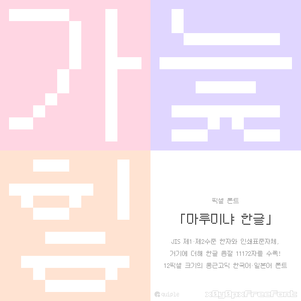

# x12y12pxMaruMinyaHangul 「마루미냐 한글」

**x12y12pxMaruMinyaHangul(마루미냐 한글)**은 12px 크기의 일본어 픽셀 폰트 '**[x12y12pxMaruMinya(マルミーニャ)](https://github.com/hicchicc/x12y12pxMaruMinya)**'를 기반으로 하는 한국어&middot;일본어 픽셀 폰트입니다.

한글 음절 11,172자와 KS X 1001(한자 제외), KS X 1003 및 JIS X 0201, JIS X 0208의 전체 문자를 지원합니다.

## 라이선스

> [!NOTE]
> ### 요약
> | 범주 | 구분 | 설명 |
> | - | - | - |
> | 상업적 이용 | ✅ 가능 | 폰트를 상업적으로 이용할 수 있습니다. 표현하는 내용이나 매체 등도 상관하지 않습니다. |
> | 임베드 | ✅ 가능 | 폰트 파일을 게임&middot;소프트웨어 등에 포함시키거나 웹 폰트로 이용할 수 있습니다. |
> | 출처 표기 | ✅ 필수 아님 | 폰트의 출처 및 저작자명을 표시하지 않아도 됩니다. |
> | 수정 및 재배포 | ✅ 가능 | 폰트를 수정하거나 재배포할 수 있습니다. 수정하여 재배포할 경우 OFL-1.1을 채택해야 합니다. |
> | 재판매 | ❌ 금지 | 폰트 파일을 단독으로 재판매하는 경우. 게임&middot;소프트웨어 등에 포함시켜 판매하는 것은 가능합니다. |
> | 이용으로 인한 피해 | ❌ 책임 안 짐 | 폰트의 이용으로 인한 피해나 손해가 생기더라도 일절 책임지지 않습니다. |

&copy; 2026 Lee Minseo (<quiple@quiple.dev>)

&copy; 2026 The x12y12pxMaruMinya Project Authors (<https://github.com/hicchicc/x12y12pxMaruMinya>)

마루미냐 한글은 SIL 오픈 폰트 라이선스 1.1에 따라 이용할 수 있습니다.

## 제작에 사용된 도구

- [BitHangul](https://bithangul.quiple.dev)
- [Bits'N'Picas](https://github.com/kreativekorp/bitsnpicas)
- [FontForge](https://fontforge.org)
